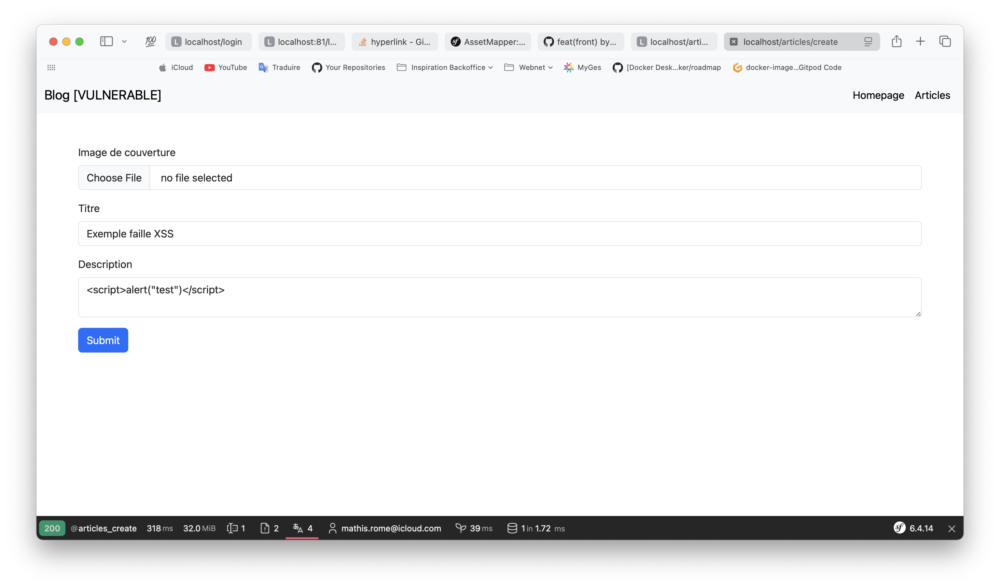
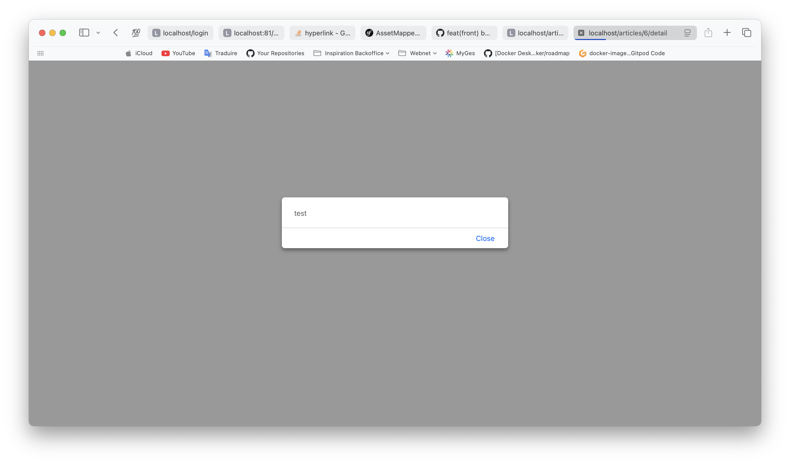
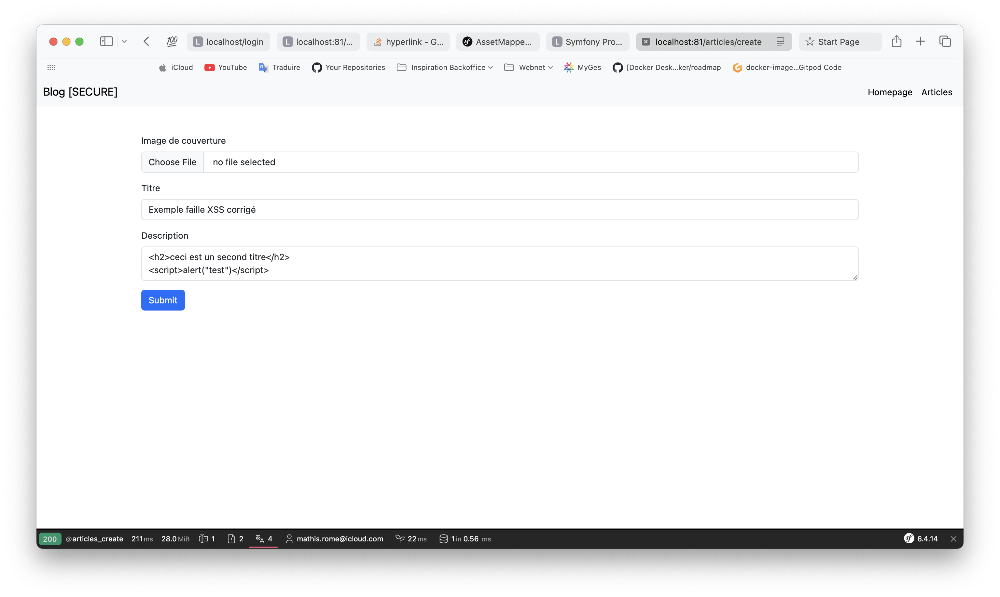
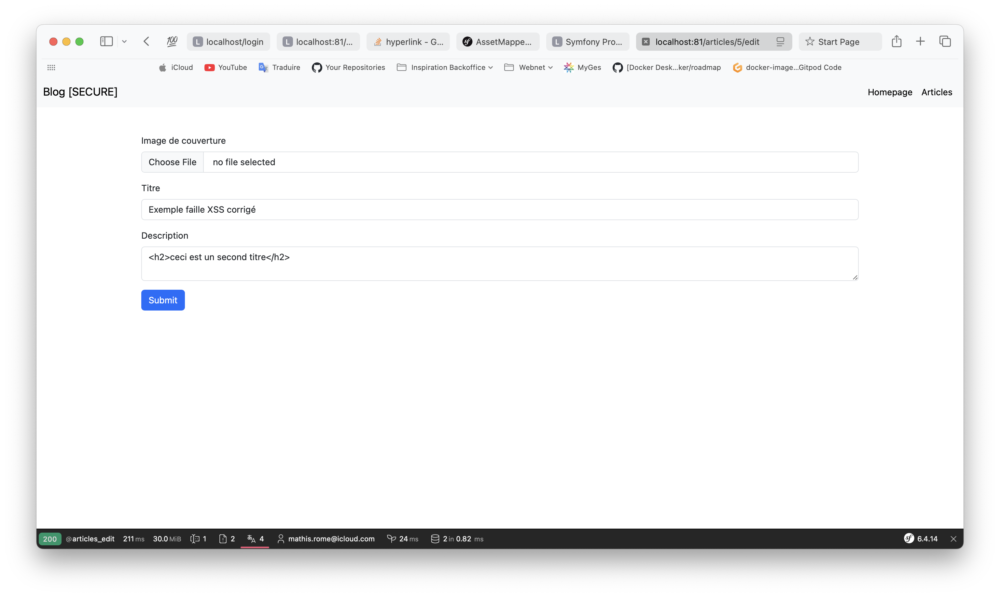
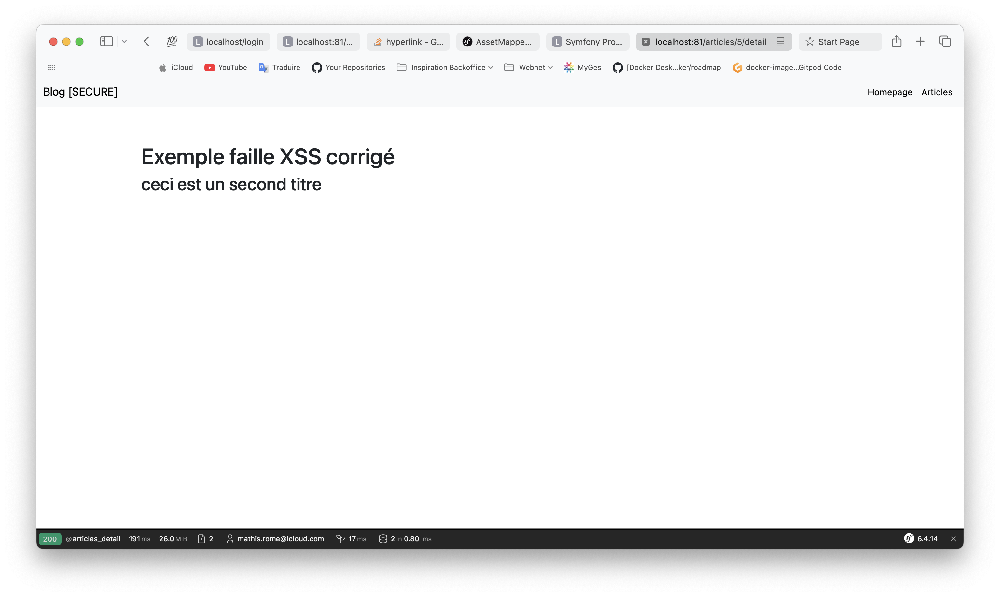
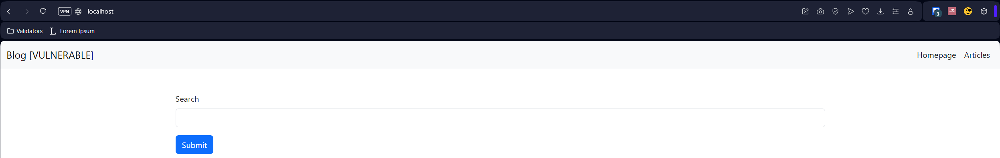
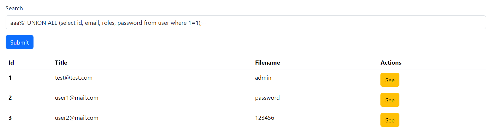
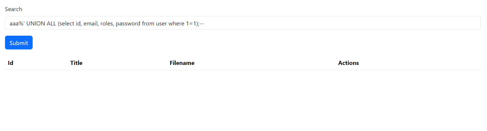

# m2-securite-web

Membre du groupe :
- SOMVEILLE Quentin
- ROME Mathis

Dans ce projet vous trouverez les dossiers suivants :
- vulnerable (qui contient l'application avec les failles de sécurité)
- secure (qui contient l'application avec toutes les failles de sécurité corrigées)

Chaque dossier contient une application Symfony, permettant la gestion d'articles.

## Lancement du projet

Nous avons fourni un `docker-compose`. 
Il lancera l'application vulnérable et secure sur les liens ci-dessous :
- [localhost:80](http://localhost:80) application vulnérable
- [localhost:81](http://localhost:81) application sécurisée

### Commande pour lancer le projet
```bash
docker compose up -d
```

## Rapport

Dans ce projet vous trouverez les failles suivantes :

- [XSS](#xss)
- [File Upload](#file-upload)
- [SQLI](#sqli)
- [Brute Force](#brute-force) 
- [Command Injection](#command-injection)

Pour reproduire les failles vous devez être connecté !

Vous pouvez créer un compte sur chaque application via les liens suivants :
- [localhost:80/register](http://localhost:80/register)
- [localhost:81/register](http://localhost:81/register)

### Brute Force
### Command Injection
### XSS
L'application est vulnérable à l'injection XSS dans la création/édition d'un article.

Pour créer un article dirigez-vous sur le lien suivant : [localhost:80/articles/create](http://localhost:80/articles/create)

Dans le champ `description` vous pouvez insérer n'importe quel balise HTML.

Voici un exemple en ajoutant du code javascript :


Une fois qu'on se sur la visualisation de l'article nous avons l'alerte suivante qui apparaît :


Voici le code associé à la faille XSS :

```php
$form->add(
    'description',
    TextareaType::class,
    [
        "label" => "Description",
    ]
)
```

Ce code correspond au champ `description` et celui-ci ne possède pas l'option qui permet
de `sanitize` le contenu mis dans le champ.

Voici le bout de code qui corrige le problème :

```php
$form->add(
    'description',
    TextareaType::class,
    [
        "label" => "Description",
        "sanitize_html" => true
    ]
)
```

L'option `sanitize_html` permet de vérifier le contenu du champ et supprime le contenu non souhaité, tel que les balises `<scrip></script>` en HTML.

Vous trouverez ci-dessous l'exemple du correctif.

1. Création d'un article 
2. Édition de l'article pour voir le contenu du champ 
3. Rendu de l'article 

### File Upload
### SQLI
L'application est vulnérable à l'injection SQL dans sa fonctionnalité de "Recherche" des articles: 


Quand l'utilisateur saisis une recherche similaire à:
```shell
aaa%' UNION ALL (select id, email, roles, password from user where 1=1);-- 
```

On obtient le résultat suivant:


On constate que l'utilisateur à la possiblité de récupérer les enregistrements de la table utilisateur et, en plus, les mots de passes ne sont pas chiffrés !

Voici le code associé à la vulnérabilité:
```php
/* App\vulnerable\src\Repository\ArticleRepository.php */

public function searchArticles(String $name): array
{
    $sql = "SELECT id, title, description, original_image_filename as originalImageFilename FROM article WHERE title LIKE '%" . $name . "%' ";
    $stmt = $this->getEntityManager()->getConnection()->prepare($sql);
    $result = $stmt->executeQuery();
    return $result->fetchAllAssociative();
}
```

La préparation de la requête n'utilise pas le binding de paramètre mais concatène le paramètre directement dans la chaîne de caractères.

Pour y remédier, nous allons utiliser le QueryBuilder de Symfony tel quel: 
```php
/* App\vulnerable\src\Repository\ArticleRepository.php */

public function searchArticles(string $title): array
{
    return $this->createQueryBuilder('a')
        ->where('a.title LIKE :title')
        ->setParameter('title', '%' . $title . '%')
        ->getQuery()
        ->getResult();
}
```

On retourne sur l'application et on essaie de nouveau l'injection SQL:


Pour vérifier, nous pouvons constater qu'il y a bien des utilisateurs en base données:

### Command Injection