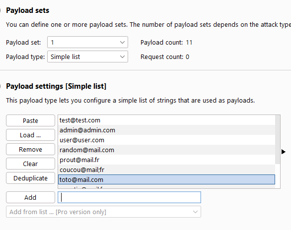
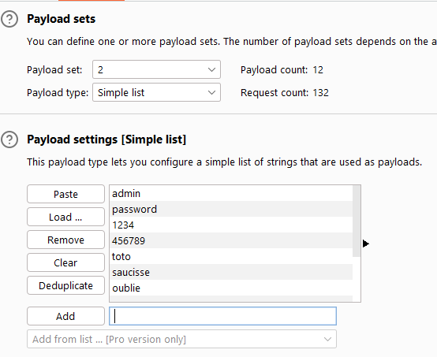
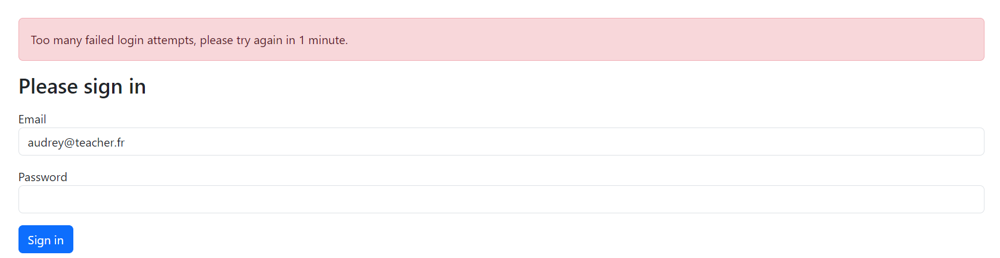

# m2-securite-web

Membre du groupe :
- SOMVEILLE Quentin
- ROME Mathis

Dans ce projet vous trouverez les dossiers suivants :
- vulnerable (qui contient l'application avec les failles de sécurité)
- secure (qui contient l'application avec toutes les failles de sécurité corrigées)

Chaque dossier contient une application Symfony, permettant la gestion d'articles.

## Lancement du projet

Nous avons fourni un `docker-compose`. 
Il lancera l'application vulnérable et secure sur les liens ci-dessous :
- [localhost:80](http://localhost:80) application vulnérable
- [localhost:81](http://localhost:81) application sécurisée

### Commande pour lancer le projet
```bash
docker compose up -d
```

## Rapport

Dans ce projet vous trouverez les failles suivantes :

- [XSS](#xss)
- [File Upload](#file-upload)
- [SQLI](#sqli)
- [Brute Force](#brute-force) 
- [Command Injection](#command-injection)
- [Access Management](#access-management)

Pour reproduire les failles vous devez être connecté !

Vous pouvez créer un compte sur chaque application via les liens suivants :
- [localhost:80/register](http://localhost:80/register)
- [localhost:81/register](http://localhost:81/register)

### Brute Force

Pour cette vulnérabilité, je vais utiliser le logiciel Burp Suite CE.
Je commence par me connecter à mon application avec l'Intruder activé pour récupérer les informations de la requête: 


J'envoie ensuite cette requête à l'intruder:


Je sélectionne une attaque par "Cluster Bomb" et ajoute deux payloads: mon username et le password. 

Dans la partie paylods, je configure des données de tests (saisies manuellement mais il est possible de récupérer des listes en lignes.)





Je démarre ensuite l'attaque:


Toutes les requêtes renvoie un code HTTP 302 - Redirect alors que la combinaison sélectionnée (test@test.com - admin) est la combinaise email/pasword permettant de se connecter.

Notre test de brute force à échoué et après inspection, il semblerait que cela est dû au système d'authentification de Symfony. 

Dans le cas où le brute force aurait fonctionné, nous avions prévue une sécurité en utilisant un rate limiter ou throttler grâce à un bundle Symfony.

Voici la configuration:
```yaml
login_throttling:
    max_attempts: 4
    interval: '45 seconds'
```

En reprenant les mêmes étapes que précdemment, je tente une attaque en brute force:


Même comportement, toutes les réponses sont des Redirect alors que la bonne combinaison est présente.

Pour tout de même tester le rate limiter, je tente de me connecter à répétition sur l'application et au bout du 5ème échec, l'application bloque mes tentatives de connexions:



### Command Injection

Une fois connecté, l'utilisateur à accès à une interface pour exécuter des commandes. Cependant, la version vulnérable ne contrôle pas la saisie
de l'utilisateur et lui permet de saisir ce qu'il souhaite: \ 


Ici, l'utilisateur a pu saisir la commande `pwd` ce qui lui permet de savoir où il se situe sur le serveur. \ 
Avec l'exemple suivvant, l'utilisateur récupère le fichier `.env` de l'application ce qui lui permettrait de récupérer des informations sur le serveur de base dedonnées, d'envoie de mail ou une clef API: \


Voici le code vulnérable: \
```php
if ($form->isSubmitted() && $form->isValid()) {
    $commande = $form->getData()['commande'];

    $output = shell_exec($commande);
}
```
C'est une simple `shell_exec()` sans vérification du contenu du formulaire. \ 

Pour sécuriser, un contrôle renforcé est effectué en configurant directement les paramètres possibles dans le formulaire Symfony:
```php
// src/Form/Type/CommandType
public function buildForm(FormBuilderInterface $builder, array $options): void
{
    $builder
        ->add('commande', ChoiceType::class, [
            'label' => 'Commande',
            'required' => true,
            'choices' => CommandEnums::toFormChoices(),
            'expanded' => false,
            'multiple' => false,
        ])
        ->add('submit', SubmitType::class, [])
    ;
}
```
Les options sont construites à partir d'une classe d'énumération:
```php
// src/Constants/Enums/CommandEnums
enum CommandEnums: string
{
    case LIKE_COMMENT = 'Met un like sur chaque commentaire';
    case ARCHIVE_PRUNE = 'Supprimer les articles archivés';


    public static function toFormChoices(): array
    {
        return [
            self::LIKE_COMMENT->value => self::LIKE_COMMENT,
            self::ARCHIVE_PRUNE->value => self::ARCHIVE_PRUNE,
        ];
    }

    public static function toCommand(CommandEnums $commandEnums): string
    {
        return match ($commandEnums) {
            self::LIKE_COMMENT => "app:comment:like",
            self::ARCHIVE_PRUNE => "app:article:prune",
            default => throw new Exception("Unknown command enum '{$commandEnums}'"),
        };
    }
}
```

L'utilisateur ne peut donc plus saisir librement une commande dans un champ input et même si il essaie de manipuler le DOM pour changer les options, la vérification des options du formulaire est appliquée:


Avec comme résultat:


L'utilisateur est maintenant limité aux possibilités fournies par l'application. 

### XSS
L'application est vulnérable à l'injection XSS dans la création/édition d'un article.

Pour créer un article dirigez-vous sur le lien suivant : [localhost:80/articles/create](http://localhost:80/articles/create)

Dans le champ `description` vous pouvez insérer n'importe quel balise HTML.

Voici un exemple en ajoutant du code javascript :


Une fois qu'on se déplace sur la visualisation de l'article nous avons l'alerte suivante qui apparaît :


Voici le code associé à la faille XSS :

```php
$form->add(
    'description',
    TextareaType::class,
    [
        "label" => "Description",
    ]
)
```

Ce code correspond au champ `description` et celui-ci ne possède pas l'option qui permet
de `sanitize` le contenu mis dans le champ.

Voici le bout de code qui corrige le problème :

```php
$form->add(
    'description',
    TextareaType::class,
    [
        "label" => "Description",
        "sanitize_html" => true
    ]
)
```

L'option `sanitize_html` permet de vérifier le contenu du champ et supprime le contenu non souhaité, tel que les balises `<script></script>` en HTML.

Vous trouverez ci-dessous l'exemple du correctif.

1. Création d'un article sur le lien suivant : [localhost:81/articles/create](http://localhost:81/articles/create) 
2. Édition de l'article pour voir le contenu du champ 
3. Rendu de l'article 

### File Upload
L'application est vulnérable à l'upload de fichier malveilllant via la création/édition d'un article.

Vous trouverez un fichier d'exemple pour faire vos tests : [file_upload.php](images/file_upload/file_upload_example.php). 
Ce fichier contient un script `php` retournant les informations sur la version de `php` installée ainsi que le contenu du fichier `.env`.

Voici un exemple avec le fichier donné :

1. Création/édition d'un article sur le lien suivant [localhost:80/articles/create](http://localhost:80/articles/create) et ajouté le fichier dans le champ `image de couverture` 
2. Une fois de retour sur la liste ouvrez la visualisation de l'article via le bouton détail 
3. Cliquer sur l'image pour copier le lien de celle-ci 
4. Ouvrez une nouvelle fenêtre et copier le lien, le fichier sera executé et vous pourrez voir les informations attendues  

La dernière image montre a quel point cette faille est dangereuse. En effet nous pouvons voir les identifiants de notre base de données et n'importe qui peut s'y connecter.

Vous trouverez le code associé à la vulnérabilité ci-dessous : 

```php
if ($form->isSubmitted() && $form->isValid()) {
    $article = $form->getData();
    $article->setUser($this->getUser());

    /** @var UploadedFile $imageFile */
    $imageFile = $form->get('image')->getData();

    // this condition is needed because the 'brochure' field is not required
    // so the PDF file must be processed only when a file is uploaded
    if ($imageFile) {
        $originalFilename = pathinfo($imageFile->getClientOriginalName(), PATHINFO_FILENAME);
        // this is needed to safely include the file name as part of the URL
        $safeFilename = $slugger->slug($originalFilename);
        $newFilename = $safeFilename.'-'.uniqid().'.'.$imageFile->getClientOriginalExtension();

        // Move the file to the directory where brochures are stored
        try {
            $imageFile->move($imagesDirectory, $newFilename);
        } catch (FileException $e) {
            // ... handle exception if something happens during file upload
        }

        // updates the 'brochureFilename' property to store the PDF file name
        // instead of its contents
        $article->setImageFilename($newFilename);
        $article->setOriginalImageFilename($originalFilename);
    }

    $em->persist($article);
    $em->flush();

    return $this->redirectToRoute('articles_index');
}
```

Le code ci-dessus enregistre le fichier, si il a été uploadé, et déplace le fichier dans le dossier `uploads/images`.

De plus voici notre configuration NGINX actuelle : 

```text
server {
    listen       80;
    server_name  _;
    root   /var/www/app/public;
    error_log /var/log/nginx/project_error.log;
    access_log /var/log/nginx/project_access.log;
    index  index.php;

    location / {
          try_files $uri /index.php$is_args$args;
    }

    location ~ \.php$ {
      fastcgi_pass vulnerable-symfony-php:9000;
      fastcgi_param SCRIPT_FILENAME $document_root$fastcgi_script_name;
      include fastcgi_params;
    }
}
```

Maintenant passons à la version sécurisé. Nous allons faire exactement les mêmes étapes

1. Création/édition d'un article sur le lien suivant [localhost:80/articles/create](http://localhost:80/articles/create) et ajouté le fichier dans le champ `image de couverture` 
2. Comme vous pouvez le voir, à l'enregistrement, nous avons une erreur spécifiant que le fichier ajouté n'est pas valide  ajouté donc une vrai image 
3. Une fois de retour sur la liste ouvrez la visualisation de l'article via le bouton détail 
4. Et voilà l'image fut ! 

Voici le code corrigé : 

```php
if ($form->isSubmitted() && $form->isValid()) {
    $article = $form->getData();
    $article->setUser($this->getUser());

    /** @var UploadedFile $imageFile */
    $imageFile = $form->get('image')->getData();

    // this condition is needed because the 'brochure' field is not required
    // so the PDF file must be processed only when a file is uploaded
    if ($imageFile) {
        $originalFilename = pathinfo($imageFile->getClientOriginalName(), PATHINFO_FILENAME);
        // this is needed to safely include the file name as part of the URL
        $safeFilename = $slugger->slug($originalFilename);
        $newFilename = $safeFilename.'-'.uniqid().'.'.$imageFile->guessExtension();

        // Move the file to the directory where brochures are stored
        try {
            $imageFile->move($imagesDirectory, $newFilename);
        } catch (FileException $e) {
            // ... handle exception if something happens during file upload
        }

        // updates the 'brochureFilename' property to store the PDF file name
        // instead of its contents
        $article->setImageFilename($newFilename);
        $article->setOriginalImageFilename($originalFilename);
    }

    $em->persist($article);
    $em->flush();

    return $this->redirectToRoute("articles_index");
}

return $this->render('article/form.html.twig', [
    'article' => $article,
    "form" => $form,
]);
```

Comme vous pouvez le voir ci-dessus, cette fois nous adaptons le nom du fichier et determinons de nous même l'extension du fichier au lieu de récupérer celle de l'utilisateur.
De plus dans le formulaire nous avons ajouté une contrainte qui n'existait pas précédemment :
```php
$form->add('image', FileType::class, [
    'label' => 'Image de couverture',

    // unmapped means that this field is not associated to any entity property
    'mapped' => false,

    // make it optional so you don't have to re-upload the PDF file
    // every time you edit the Product details
    'required' => false,
    'constraints' => [
        new Image(
            maxSize: '2M',
        ),
    ]
])
```

Pour augmenter la sécurité nous avons modifier notre configuration NGINX, pour obliger le serveur à exécuter uniquement le fichier `index.php` dans le dossier `public`.
Voici le fichier :

```text
server {
    listen       80;
    server_name  _;
    root   /var/www/app/public;
    error_log /var/log/nginx/project_error.log;
    access_log /var/log/nginx/project_access.log;
    client_max_body_size 500M; # allows file uploads up to 500 megabytes


    location / {
        try_files $uri /index.php$is_args$args;
    }

    location ~ ^/index\.php(/|$) {
        fastcgi_pass secure-symfony-php:9000;
        fastcgi_split_path_info ^(.+\.php)(/.*)$;
        include fastcgi_params;

        fastcgi_param SCRIPT_FILENAME $realpath_root$fastcgi_script_name;
        fastcgi_param DOCUMENT_ROOT $realpath_root;
        internal;
    }

    location ~ \.php$ {
        return 404;
    }
}
```

### SQLI
L'application est vulnérable à l'injection SQL dans sa fonctionnalité de "Recherche" des articles: 


Quand l'utilisateur saisis une recherche similaire à:
```shell
aaa%' UNION ALL (select id, email, roles, password from user where 1=1);-- 
```

On obtient le résultat suivant:


On constate que l'utilisateur à la possiblité de récupérer les enregistrements de la table utilisateur et, en plus, les mots de passes ne sont pas chiffrés !

Voici le code associé à la vulnérabilité:
```php
/* App\vulnerable\src\Repository\ArticleRepository.php */

public function searchArticles(String $name): array
{
    $sql = "SELECT id, title, description, original_image_filename as originalImageFilename FROM article WHERE title LIKE '%" . $name . "%' ";
    $stmt = $this->getEntityManager()->getConnection()->prepare($sql);
    $result = $stmt->executeQuery();
    return $result->fetchAllAssociative();
}
```

La préparation de la requête n'utilise pas le binding de paramètre mais concatène le paramètre directement dans la chaîne de caractères.

Pour y remédier, nous allons utiliser le QueryBuilder de Symfony tel quel: 
```php
/* App\vulnerable\src\Repository\ArticleRepository.php */

public function searchArticles(string $title): array
{
    return $this->createQueryBuilder('a')
        ->where('a.title LIKE :title')
        ->setParameter('title', '%' . $title . '%')
        ->getQuery()
        ->getResult();
}
```

On retourne sur l'application et on essaie de nouveau l'injection SQL:


Pour vérifier, nous pouvons constater qu'il y a bien des utilisateurs en base données:

### Command Injection
### Access Management
La vulnérabilité se situe sur la liste, la vue et l'édition d'un article. Un utilisateur peut manipuler l'url pour accéder à l'article d'un autre utilisateur.

L'utilisateur `test@test.com` possède les articles suviants:


Je connecte maintenant avec un autre utilisateur, l'utilisateur `user1@mail.com` qui possède les articles suivants:


En cliquant sur le bouton "Edit", il arrive sur le formulaire d'édition de son article:


En modifiant l'url de la page pour changer l'identifiant de l'article de 4 à 3, on arrive sur la page d'édition d'un article qui l'utilisateur ne possède normalement pas:


L'utilisateur peut maintenant modifier l'article à sa guise et s'en approprier la possession en enregistrant les modifications:


L'article apparaît maintenant dans sa liste. Je me connecte avec le premier utilisateur et on peut constater que l'article n'apparaît plus dans sa liste:


Pour résoudre le problème, nous allons utiliser le système de droit de Symfony en créant un "Voter":
```php
<?php
namespace App\Security\Voters;

use App\Entity\Article;
use App\Entity\User;
use Symfony\Component\Security\Core\Authentication\Token\TokenInterface;
use Symfony\Component\Security\Core\Authorization\Voter\Voter;

class ArticleVoter extends Voter
{
    // On déifnit les constantes que l'on désire
    const VIEW = 'view';
    const EDIT = 'edit';

    protected function supports(string $attribute, mixed $subject): bool
    {
        // Si l'attribut n'est pas supporté
        if (!in_array($attribute, [self::VIEW, self::EDIT])) {
            return false;
        }

        // On ne contrôle que les objets de type Article
        if (!$subject instanceof Article) {
            return false;
        }

        return true;
    }

    protected function voteOnAttribute(string $attribute, mixed $subject, TokenInterface $token): bool
    {
        $user = $token->getUser();

        // L'utilisateur doit être connecté
        if (!$user instanceof User) {
            return false;
        }

        /** @var Article $article */
        $article = $subject;

        return match ($attribute) {
            self::VIEW => $this->canView($article, $user),
            self::EDIT => $this->canEdit($article, $user),
            default => false,
        };
    }

    // Logique métier pour vérifier que l'utilisateur peut visualiser l'article
    private function canView(Article $article, User $user): bool
    {
        return $this->canEdit($article, $user);
    }

    // Logique métier pour vérifier que l'utilisateur peut éditer l'article
    private function canEdit(?Article $article, User $user): bool
    {
        return $article->getUser() === $user || is_null($article);
    }
}
```

On fait appelle au Voter dans les routes nécessaires:
```php
#[Route('/{id}/detail', name: 'detail')]
public function detail(
    Article $article
): Response {
    $this->denyAccessUnlessGranted('view', $article);

    return $this->render('article/detail.html.twig', [
        "article" => $article,
    ]);
}

#[Route('/create', name: 'create')]
#[Route('/{id}/edit', name: 'edit')]
public function createOrUpdate(
    Request $request,
    EntityManagerInterface $em,
    SluggerInterface $slugger,
    #[Autowire('%kernel.project_dir%/public/uploads/images')] string $imagesDirectory,
    ?Article $article
): Response
{
    if (empty($article)) {
        $article = new Article();
    } else {
        $this->denyAccessUnlessGranted('edit', $article); // Appelle au voter
    }
    // ...
}
```

On se connecte avec un utilisateur qui possède un seul article ayant l'identifiant 2: \


Et on modifie l'url pour essayer d'accéder à l'article ayant l'identifiant 1: \


L'utilisateur n'ayant pas les droits de lecture et d'édition à cet article, l'application renvoie une AccessDeniedException soit une réponse HTTP 403: Forbidden. 